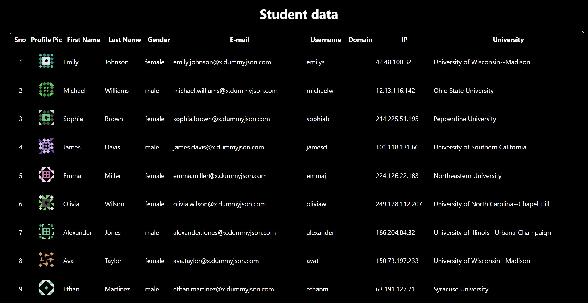

# 📋 User Data Table Viewer (React)

A React application that fetches user data from an external API and displays it in a structured, searchable table. Built as part of a React learning task to practice API integration and data rendering on the client side.

🔗 **Live Demo:** [https://task4-react-js.vercel.app/](https://task4-react-js.vercel.app/)

---

## 🚀 Features

- Fetches user records from `https://dummyjson.com/users`  
- Displays user data in a responsive table  
- Client-side data rendering using React hooks  
- Clean and organized UI layout  

---

## 📸 Screenshot

### 🏠 Home Page

This is the initial view of the page when loaded.



---

## ⚙️ Tech Stack

- ReactJS  
- HTML5 & CSS3  
- JavaScript (ES6)  
- Fetch API

---

## 📦 Installation & Setup

1. **Clone the repository:**
   ```bash
   git clone # 📋 User Data Table Viewer (React)

A React application that fetches user data from an external API and displays it in a structured, searchable table. Built as part of a React learning task to practice API integration and data rendering on the client side.

🔗 **Live Demo:** [https://task4-react-js.vercel.app/](https://task4-react-js.vercel.app/)

---

## 🚀 Features

- Fetches user records from `https://dummyjson.com/users`  
- Displays user data in a responsive table  
- Client-side data rendering using React hooks  
- Clean and organized UI layout  

---

## ⚙️ Tech Stack

- ReactJS  
- HTML5 & CSS3  
- JavaScript (ES6)  
- Fetch API

---

## 📦 Installation & Setup

1. **Clone the repository:**
   ```bash
   git clone https://github.com/your-username/user-data-table-viewer.git
   cd user-data-table-viewer
